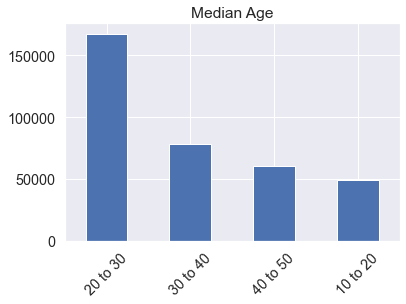
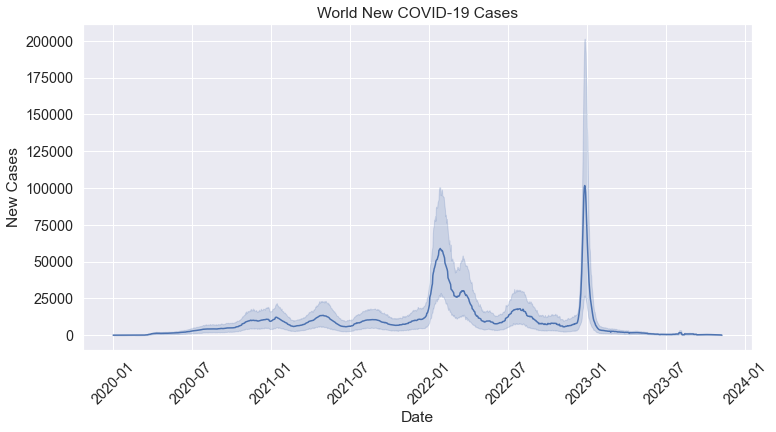
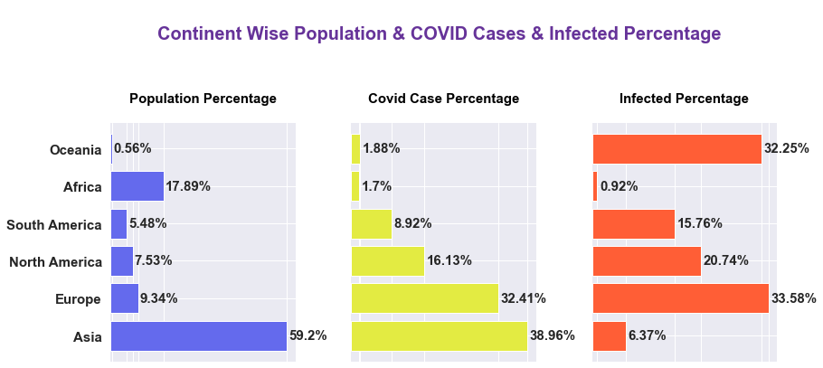
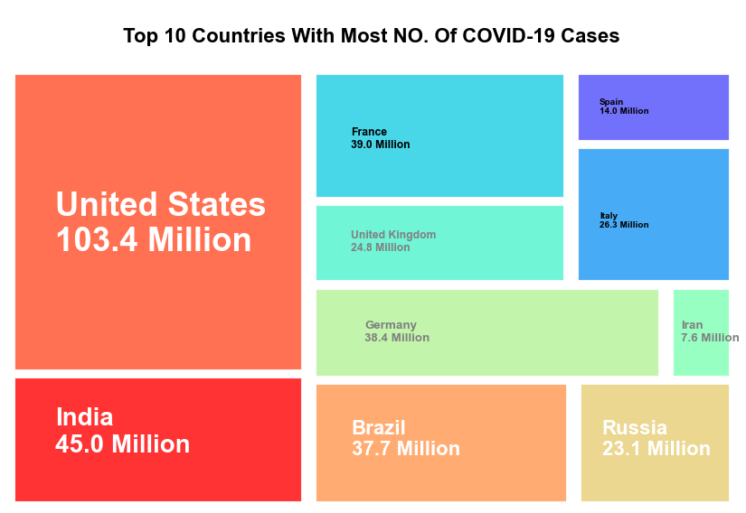
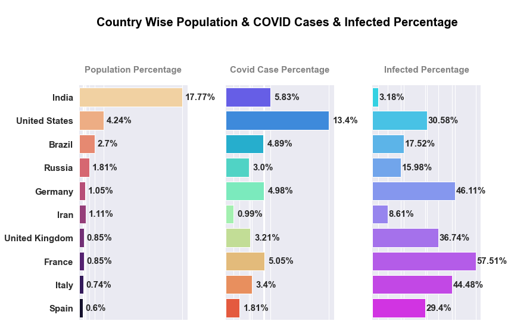
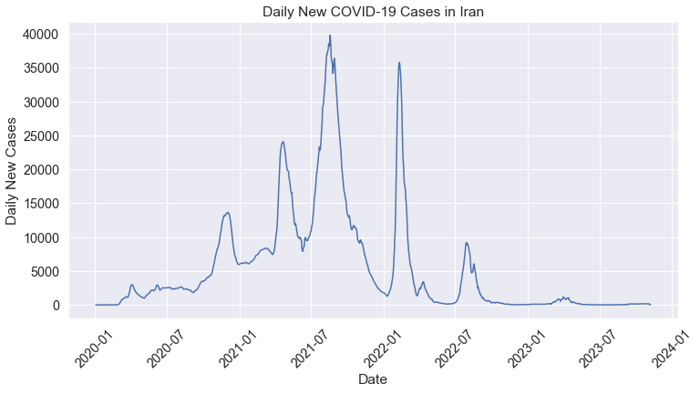

# Corona Virus Dataset Analysis
[Dataset](https://github.com/owid/covid-19-data/blob/master/public/data/owid-covid-data.csv)

## Contents
### Data Cleaning
* Missing Values
    * Columns removal 
    * Constant imputation
    * Median imputation

* Handling Outliers
  * IQR method
  * Winsorization

* Discretization

### Data Understanding and EDA
* **Univariate Analysis**
  * Numerical features
  * Categorical features

  * 
  

* **Bivariate Analysis**
  * World Wide Analysis

  * 

  * Continent Wise Analysis
  * 

  * .png)

  * Country Wise Analysis
  * 

  * 

  * Analysing Iran 
  * 